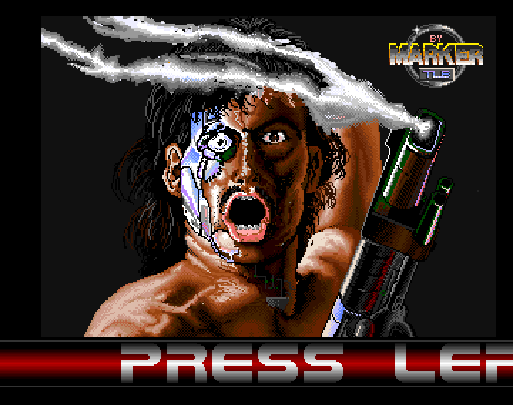
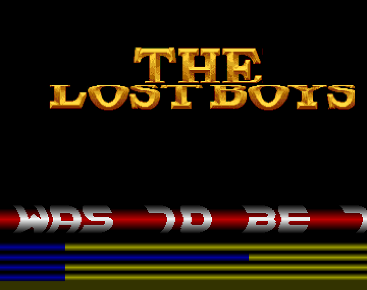

# Amiga Intro/Demo code 
Amiga 68000 Assembly Intro/Demo code written in 1988, for the Amiga 500.
 
Some of the code was found hiding on old floppy discs, whilst others have been reverse engineered.
 
Minor updates have been made as the code didn't run on an A1200.
 
 
The image below shows the Hawkeye intro. This intro was written to show off Markers pixel skills.
 
Minor code updates have been made to the fader routine as it kept crashing on the A1200.
 

 
The image below shows the an intro for the "Mega Demo" that never made it to fruition...
 
This intro was released as "My Final Demo" !!
 
